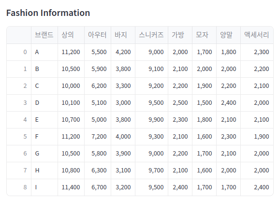
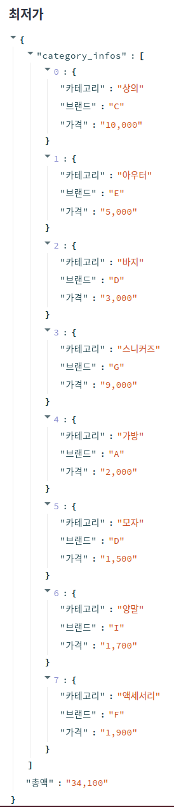
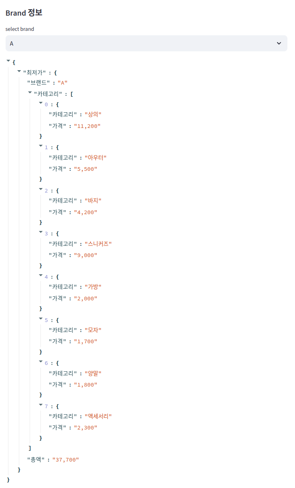
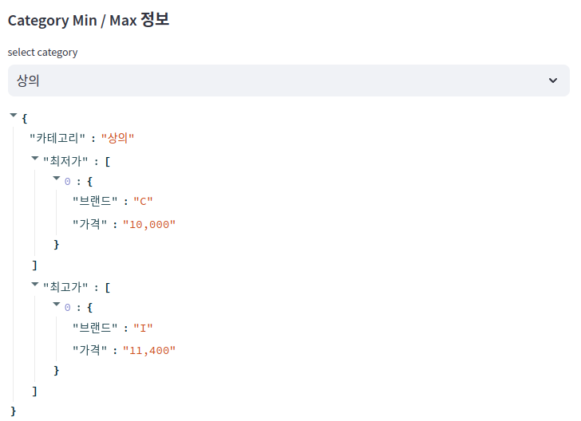
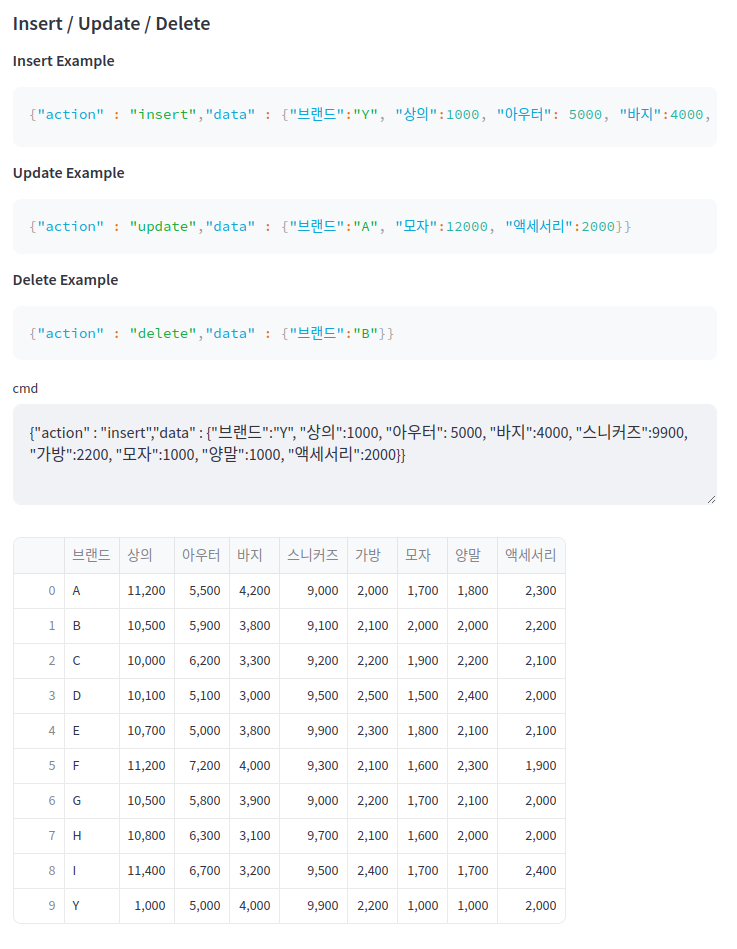
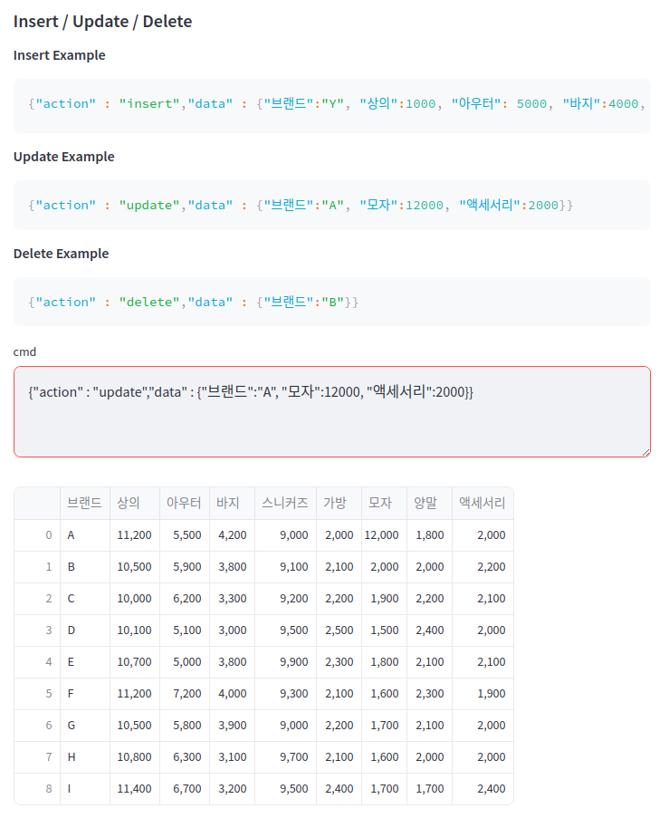
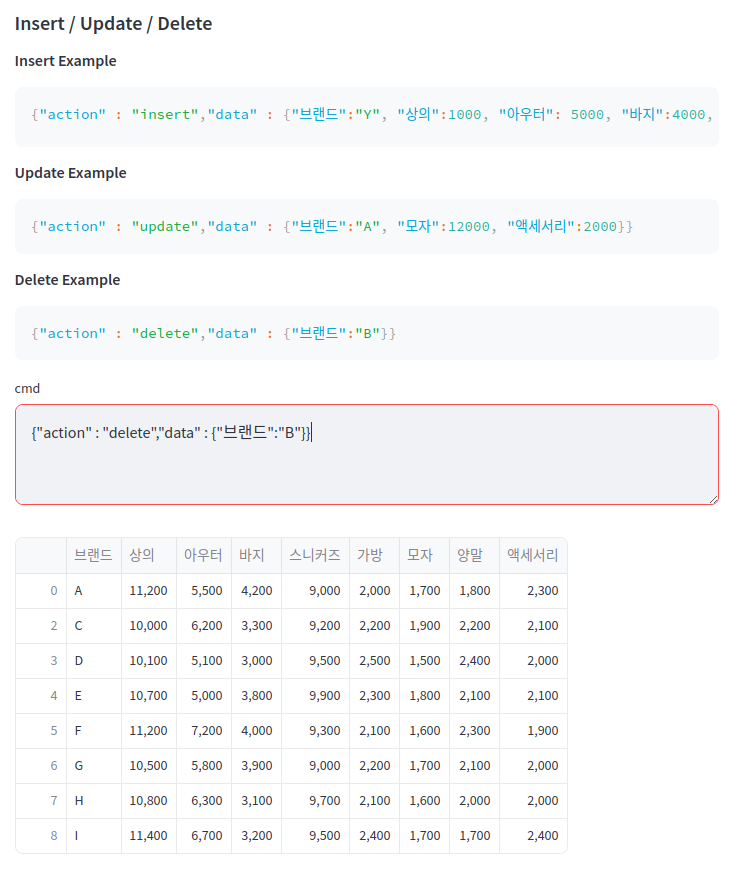

# env &setting
* OS : Ubuntu 24.04 LTS
* python : 3.12.3

## virtualenv setting

* ubuntu 용 virtualenv 설치 ( pipx 사용 )
```bash
$ pipx install virtualenv
# PATH 추가
$ export PATH=~/.local/bin:${PATH}
```
* virtualenv 셋팅.
```bash
$ virtualenv assignment_m --python=python3.12.3

$ cd assignment_m/
$ source ./bin/activate

```
## 환경 셋팅.
```bash
# jupyter==1.0.0
# scikit-learn==1.5.0
# pandas==2.2.2
# tabulate==0.9.0
# streamlit==1.36.0
$ pip install -r requirements.txt
```

#  Demo
* streamlit 실행
```bash
$ cd src
# streamlit 실행
$ streamlit run ./fashionRecommendationDemo.py
http://localhost:8501/
```
* 기본 패션 데이터



* 구현 1) - 카테고리 별 최저가격 브랜드와 상품 가격, 총액을 조회



* 구현 2) - 단일 브랜드로 모든 카테고리 상품을 구매할 때 최저가격에 판매하는 브랜드와 카테고리의 상품가격, 총액을 조회



* 구현 3) - 카테고리 이름으로 최저, 최고 가격 브랜드와 상품 가격을 조회



* 구현 4) 브랜드 및 상품을 추가 / 업데이트 / 삭제
    * 추가

    * 업데이트

    * 삭제


